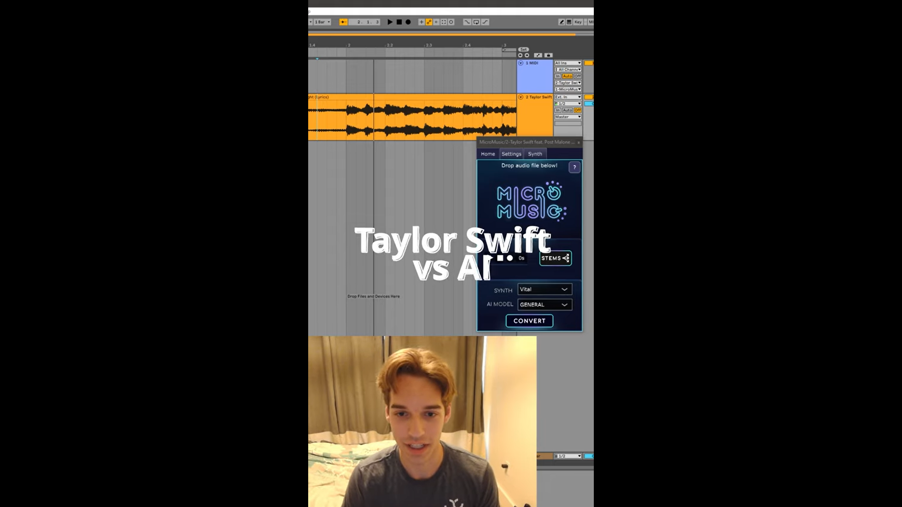

# 1. Discord_AIbot
在這一個專案中，我使用了discord api創建了一個聊天機器人，並串接多個預訓練模型達成不同任務的處理，當使用者沒有使用指令時，就會交給`llama 3.1 70B`負責回答問題，這一個模型可以用的工具有兩個，`get_time`和`RAG`，而使用者能用指令有三個：

`!transcribe`：使用指令後將`mp3`檔案上傳至discord，這個功能會將音樂中的歌詞提取出來顯示在UI上

`!readpdf`：使用指令後將`pdf`檔案上傳至discord，這個功能會將使用者的pdf處理成結構化資料儲存在伺服器中，並且提供LLM的`RAG`工具查詢

`!helper`：打印出全部可使用的指令及功能解釋

## Results

# 2. VST presets generator (in progress: data collection)
這個專案目前還在構建當中，其主要目的是訓練出一個NN模型，在搭配自己設計的UI讓編曲家在設計聲音時能夠更方便，使用方法為將一段`mp3`檔案上傳至應用程式中，經過處理後輸出VST(virtual instrument technology)插件的參數檔案，這個檔案可以被插件讀取，並且聲音會接近原始`mp3`檔案的聲音

## Project example

# 3. Federated MMoE
這是我碩士論文研究的主題，目的是要做一個推薦系統，來最大化快取空間的利用率，同時還考慮使用者安全隱私性的問題，在這個研究中我們使用Federaed learning的方法解決使用者安全隱私問題，並透過MMoE模型架構精準預測出每個使用者存取電影的的機率，其過程為：
1. 本地訓練：每一個本地伺服器會在本地做邊端訓練
2. 中心平均：本地模型訓練幾輪後，會將模型參數上傳至中心服務器，經由中心服務器平均拿到的模型參數後，再廣播給每一個本地模型
3. 本地再訓練：拿到平均的參數後，本地模型會將平均的模型參數取代下圖中紅色區塊的部分，其他的部分則是保留原本的參數，接著再對模型做訓練，重複步驟2、3直到收斂

