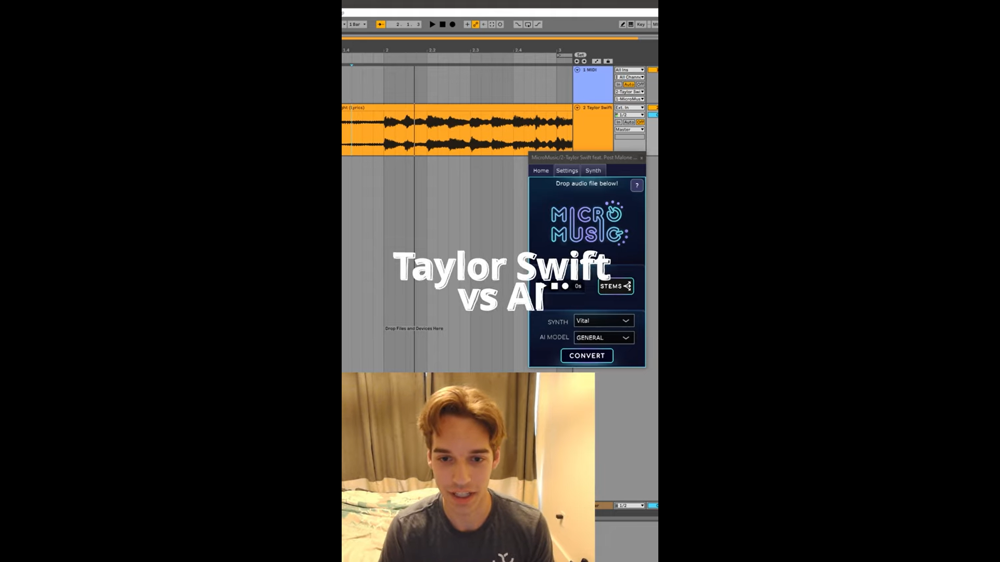

# 1. Discord AI Bot
In this project, I used the Discord API to create a chatbot and connected it with multiple pre-trained models to achieve different task processing. When the user does not use commands, it will be handled by the `llama 3.1 70B` model, which has two tools, `get_time` and `RAG`, and users can use three commands:

`!transcribe`: Use the command to upload an `mp3` file to Discord, which will extract the lyrics from the music and display them on the UI.

`!readpdf`: Use the command to upload a `pdf` file to Discord, which will process the user's PDF into structured data stored on the server and provide the LLM's `RAG` tool for querying.

`!helper`: Print out all available commands and function explanations.

## Results

# 2. VST Presets Generator (in progress: data collection)
This project is currently under construction, with the main goal of training an NN model to provide a convenient UI for music producers to design sounds. The method is to upload an `mp3` file to the application, process it, and output a VST (Virtual Instrument Technology) plugin parameter file, which can be read by the plugin and produce a sound similar to the original `mp3` file.

## Project example

# 3. Federated MMoE
This is the main topic of my master's thesis research, aiming to develop a recommendation system that maximizes cache space utilization while considering user security and privacy issues. In this research, we use Federated learning to solve user security and privacy issues and accurately predict the probability of each user accessing movies through the MMoE model architecture. The process is:
1. 本地訓練：每一個本地伺服器會在本地做邊端訓練
2. 中心平均：本地模型訓練幾輪後，會將模型參數上傳至中心服務器，經由中心服務器平均拿到的模型參數後，再廣播給每一個本地模型
3. 本地再訓練：拿到平均的參數後，本地模型會將平均的模型參數取代下圖中紅色區塊的部分，其他的部分則是保留原本的參數，接著再對模型做訓練，重複步驟2、3直到收斂

